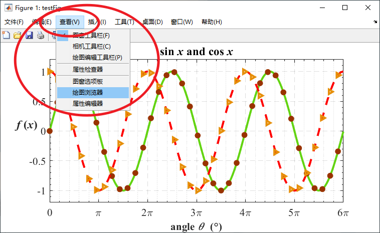
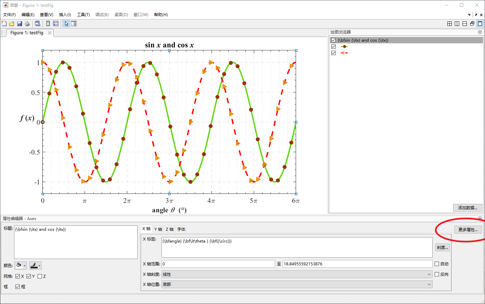
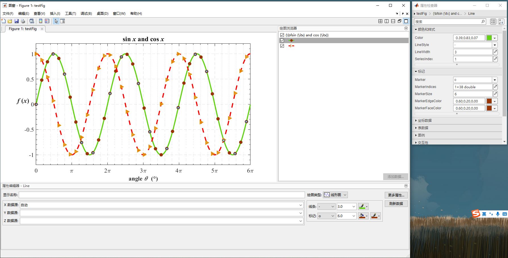
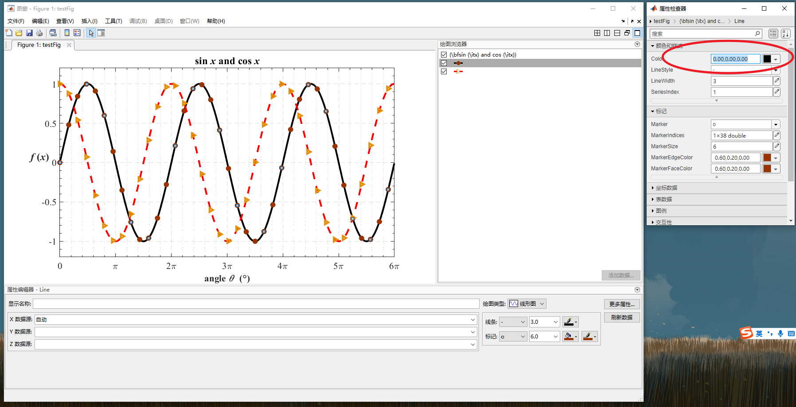

# matlab 绘图学习笔记

_渡河蚂蚁_
_2023 年 10 月 11 日星期三_

---

论文通常需要规范且精美的配图,之前是用 origin 或者 matlab 画的，每画一个新图，都要重新设置一遍格式，格式的复制粘贴也比较麻烦（或者说我不会）希望能够有一种方式，能够在替换数据之后，快速设置图片的格式，最好是把图片以代码的形式存储起来，而不是存储图片本身，这样，运行一遍代码，图就自己出来了，matlab 可以实现这个功能。

---

首先，画一个简单的图

```matlab

myFig = figure(1); %创建myFig对象
x = (0:0.01:6 * pi);
line_sinx = plot(x, sin(x)); %创建sinx波形对象
hold on;
line_cosx = plot(x, cos(x)); %创建cosx波形对象

```

<!--  -->


---
我比较习惯用这样的方式：先创建一个对象，再修改这个对象的属性（也可以通过函数的方式修改对象）
可以通过“myFig.”的方式来查看有哪些属性可以编辑(需要工作区事先有这个变量)

这样是没反应的

<!--  -->


需要这样

<!--  -->


至于为什么，应该也很好理解，就是先要有这样一个对象，才能查看它的属性

---

```matlab
% *************************************************************************
% 	* @File Name: matlabplot.m
% 	* @Author: jhshe
%   * @Version: 1.0
% 	* @ Mail: *****@foxmail.com
% 	* @ Created Time: 2023/10/11 星期三
%  ************************************************************************

clc, clear, close all;
%% =============== 参数化设置属性 start =====================================
figureFontSize = 16; %图片中文字的大小
axesLineWidth = 1; %坐标轴的线宽
waveLineWidth = 3; %波形的线宽
% =============== 参数化设置属性 end =====================================

%% =============== 画图 start =====================================
myFig = figure(1); %创建myFig对象
myFig.Name = "testFig";
myFig.Units = "centimeters";
myFig.Position = [35 18 20 10]; %坐标x,y,长，宽
myFig.Color = [1 1 1]; %背景色白色
x = (0:0.01:6 * pi);
wave_sinx = plot(x, sin(x)); %创建sinx波形对象
hold on;
wave_cosx = plot(x, cos(x)); %创建cosx波形对象
hold on;
% =============== 画图 end =====================================

%% =============== 修改坐标轴属性 start =====================================
ax = gca; %获取当先坐标轴(get current axes)
ax.XLim = [0 6 * pi];
ax.YLim = [-1.2 1.2];
ax.FontSize = figureFontSize;
ax.FontName = "Times";
ax.GridLineStyle = "--";
ax.XGrid = "on";
ax.XMinorGrid = "on";
ax.XMinorTick = "on";
ax.YGrid = "on";
ax.YMinorGrid = "off";
ax.YMinorTick = "on";
ax.LineWidth = axesLineWidth;
ax.XLabel.FontSize = figureFontSize;
ax.XTick = [0 pi 2 * pi 3 * pi 4 * pi 5 * pi 6 * pi];
ax.XTickLabel = ["0"; "\pi"; "2\pi"; "3\pi"; "4\pi"; "5\pi"; "6\pi"];
ax.XLabel.String = "{\bfangle} {\bf\it\theta } {\bf({\circ})}";
ax.YLabel.String = "{\bf{\it f }({\itx})} ";
ax.YLabel.Rotation = 0;
ax.Title.String = "{\bfsin {\itx} and cos {\itx}}";
% =============== 修改坐标轴属性 end =====================================

%% =============== 修改波形属性 start =====================================
wave_sinx.Color = [0,0,0];
wave_sinx.LineStyle = "-";
wave_sinx.LineWidth = waveLineWidth;
wave_sinx.Marker = "o";
wave_sinx.MarkerIndices = (1:50:length(sin(x))); %曲线上的标记点(避免数据标记过于密集)
wave_sinx.MarkerFaceColor = [0.60,0.20,0.00];
wave_sinx.MarkerEdgeColor = [0.60,0.20,0.00];
wave_sinx.MarkerSize = waveLineWidth * 2;

wave_cosx.Color = "red";
wave_cosx.LineStyle = "--";
wave_cosx.LineWidth = waveLineWidth;
wave_cosx.Marker = ">";
wave_cosx.MarkerIndices = (1:50:length(cos(x)));
wave_cosx.MarkerFaceColor = "none";
wave_cosx.MarkerEdgeColor = [0.90, 0.56, 0.04]; %调整曲线的RGB色
wave_cosx.MarkerSize = waveLineWidth * 2;
% =============== 修改波形属性 end =====================================

%% 复制到剪切板，导出为tiff文件
copygraphics(myFig, "Resolution", 600);
exportgraphics(myFig, "myFig.tiff","Resolution", 600);

```

<!--  -->


如果对于图片的某个属性不满意，可以先在$figure$图窗里调整好，再写进程序里
例如：觉得图中的绿线太亮了，黑色圈圈的标记太丑了
把_绘图浏览器_和_属性编辑器_都点上

就成了这样

更多属性也点上

觉得这个黑色比较好看，那就把这个属性再填回程序中，这样以后就能一键运行了


试一下公式能不能显示

When $a \ne 0$, there are two solutions to $(ax^2 + bx + c = 0)$ and they are
$$ x = {-b \pm \sqrt{b^2-4ac} \over 2a} $$

The Cauchy-Schwarz Inequality

$$\left( \sum_{k=1}^n a_k b_k \right)^2 \leq \left( \sum_{k=1}^n a_k^2 \right) \left( \sum_{k=1}^n b_k^2 \right)$$
