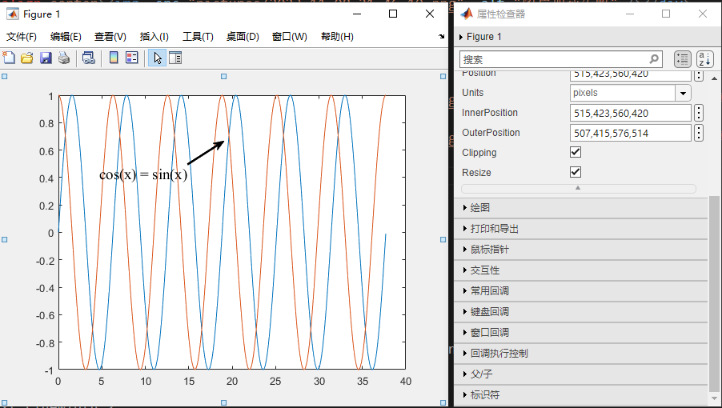

# matlab 绘图学习笔记

<!-- vscode-markdown-toc -->

- 1. [科研绘图常用软件(数据图)](#)
  - 1.1. [matlab](#matlab)
  - 1.2. [origin](#origin)
  - 1.3. [python](#python)
  - 1.4. [R 语言](#R)
  - 1.5. [其它](#-1)
- 2. [matlab 绘图](#matlab-1)
- 3. [细节调整与其他](#-1)
  - 3.1. [调整坐标轴小数位数](#-1)
  - 3.2. [调整图例中线段的长度](#-1)
  - 3.3. [双坐标轴](#-1)
  - 3.4. [添加标注](#-1)
  - 3.5. [其他类型的图&&图通道](#-1)

<!-- vscode-markdown-toc-config
	numbering=true
	autoSave=true
	/vscode-markdown-toc-config -->
<!-- /vscode-markdown-toc -->

_渡河蚂蚁_
_创建时间：2023 年 10 月 11 日星期三_
_更新时间：2023 年 11 月 8 日星期三_

---

论文通常需要规范且精美的配图,之前是用 origin 或者 matlab 画的，每画一个新图，都要重新设置一遍格式，格式的复制粘贴也比较麻烦（或者说我不会）希望能够有一种方式，能够在替换数据之后，快速设置图片的格式，最好是把图片以代码的形式存储起来，而不是存储图片本身，这样，运行一遍代码，图就自己出来了，matlab 可以实现这个功能。

---

## 1. <a name=''></a>科研绘图常用软件(数据图)

matlab origin python R 语言 其它

> **参考链接**
> 【12 个科研绘图必备软件】 https://www.bilibili.com/video/BV1wF411o7ZT/?share_source=copy_web&vd_source=19f85e505ef22e6080386d325bf9be63
>
> 【绘科研】https://www.figdraw.com/static/index.html#/
>
> 【图通道】https://space.bilibili.com/223755925
>
> 【知乎笔记】https://www.zhihu.com/people/zhuzhulili/posts

---

### 1.1. <a name='matlab'></a>matlab

<div align=center></div>

<div align=center></div>

---

### 1.2. <a name='origin'></a>origin

<div align=center></div>

<div align=center></div>

---

### 1.3. <a name='python'></a>python

<div align=center></div>

<div align=center></div>

---

### 1.4. <a name='R'></a>R 语言

<div align=center></div>

---

### 1.5. <a name='-1'></a>其它

GraphPadPrison SigmaLot EXCEL

---

## 2. <a name='matlab-1'></a>matlab 绘图

首先生成数据

```matlab
step=1e-2;
x= (0:step:6*pi);
sinx=sin(x);
cosx=cos(x);
```

如何从外部文件导入数据呢？导入方法非常多，可以上网自行查找
首先创建一个文件（也可以直接从已有数据导入）

```
writematrix(sinx,"testData.xls");
```

<div align=center></div>

报错了，也可以从工作区发现，数据为一个行向量，行数太多

<div align=center></div>

解决报错

```matlab
step=1e-2;
x= (0:step:6*pi)';
sinx=sin(x);
cosx=cos(x);
writematrix(x,   "testData.xls","Sheet",1,"Range","A1");
writematrix(sinx,"testData.xls","Sheet",1,"Range","B1");
writematrix(cosx,"testData.xls","Sheet",1,"Range","C1");
```

读取数据

```matlab
data=readmatrix("testData.xls");
```

开始画图

```matlab
plot(data(:,1),data(:,2));
hold on;
plot(data(:,1),data(:,3));
hold on;
```

<div align=center></div>

有很多种方式可以修改图片中坐标轴、线条的属性
例如修改背景色

```matlab
set(gca,'Color',[1 1 1])
```

对于 gca，看一下 help 文档

<div align=center></div>

在依次输入 set 的参数时，会有相应的提示，这可以看成，“gca”这个结构体中，有哪些参数可以赋值

<div align=center></div>

也可以在命令行窗口看一看（脚本文件中不打分号也是一样的效果）

<div align=center></div>

添加 x 轴标签

```matlab
xlabel("xlable","FontSize",12)
```

<div align=center></div>

---

**但是这样存在一些问题，如何知道有这些函数的存在，如何寻找这些函数，怎么查找函数需要哪些参数**

以这种方式画图的例子见"otherFiles/testplot.m"

我比较习惯用这样的方式：先创建一个对象，再修改这个对象的属性（也可以通过函数的方式修改对象）
可以通过“myFig.”的方式来查看有哪些属性可以编辑(需要工作区事先有这个变量)

这样是没反应的

<div align=center></div>

需要这样

<div align=center></div>

至于为什么，应该也很好理解，就是先要有这样一个对象，才能查看它的属性

---

首先，画一个简单的图

```matlab
myFig = figure(1); %创建myFig对象
L_sinx = plot(x, sinx); %创建sinx波形对象
hold on;
L_cosx = plot(x, cosx); %创建cosx波形对象
hold on;

```

<div align=center></div>

看看对于这个 figure,有哪些属性可以修改

<div align=center></div>

所有属性,以及修改了会有什么效果,在这里看,可以自己尝试修改,把觉得合适的效果记录到程序中

<div align=center></div>

需要注意想要修改的属性属于哪个对象,例如这里修改了 cos 波形的线宽

<div align=center></div>

和在程序中写下`L_cosx.LineWidth=2;`效果是一样的

想修改背景的颜色,显然需要去 figure 对象中找,想修改坐标轴区域的属性,则需要去 axes 对象中找

在执行完下面一段程序后,图形变成了这样

<div align=center></div>

```
myFig = figure(1); %创建myFig对象
myFig.Name = "testFig";
myFig.Units = "centimeters";
myFig.Position = [20 18 20 10]; %坐标x,y,长，宽
myFig.Color = [1,1,1]; %背景色白色
```

在执行完下面一段程序后,图形变成了这样

<div align=center></div>

```matlab
%% 修改坐标轴属性 start =========================
ax = gca; %获取当先坐标轴(get current axes)
ax.XLim = [0 6 * pi];
ax.YLim = [-1.2 1.2];
ax.FontSize = figureFontSize;
ax.FontName = "Times New Roman";
ax.GridLineStyle = "--";
ax.XGrid = "on";
ax.XMinorGrid = "on";
ax.XMinorTick = "on";
ax.YGrid = "on";
ax.YMinorGrid = "off";
ax.YMinorTick = "on";
ax.LineWidth = axesLineWidth;
% ax.YTickLabel=num2str(get(gca,'yTick')','%.1f');
ax.XLabel.FontSize = figureFontSize;
ax.XTick = (pi:pi:6*pi);
ax.XTickLabel=num2str(get(gca,'xTick')'/pi,"%d\x03C0");
% 方法1
% temp=num2str(get(gca,'xTick')'/pi,"%d");
% for i=1:1:length(temp)
% temp1(i,:)=[temp(i),'\pi'];
% end
% set(gca,'xTickLabel',temp1);
% 方法2
% ax.XTick = (0:pi:6*pi);
% ax.XTickLabel = ["0"; "\pi"; "2\pi"; "3\pi"; "4\pi"; "5\pi"; "6\pi"];
% 方法3
set(gca,'xTickLabel',num2str(get(gca,'xTick')'/pi,"%d\x03C0"));
% ax.XLabel.Interpreter="latex";
ax.XLabel.String = "{\bfangle} {\bf\theta }";
ax.YLabel.String = "{\bf{\it f }({\theta})} ";
ax.YLabel.Rotation = 0;
ax.Title.String = "{\bfsin {\itx} and cos {\itx}}";

% =============== 修改坐标轴属性 end =====================================
```

修改一下波形的属性

<div align=center></div>

```matlab
%% =============== 修改波形属性 start =====================================
L_sinx.Color = [0,0,0];
L_sinx.LineStyle = "--";
L_sinx.LineWidth = waveLineWidth;
L_sinx.Marker = "o";
L_sinx.MarkerIndices = (1:50:length(sin(x))); %曲线上的标记点(避免数据标记过于密集)
L_sinx.MarkerEdgeColor = [0,0,0];
L_sinx.MarkerFaceColor = "auto";
L_sinx.MarkerSize = waveLineWidth * 2;

L_cosx.Color = "red";
L_cosx.LineStyle = "--";
L_cosx.LineWidth = waveLineWidth;
L_cosx.Marker = "diamond";
L_cosx.MarkerIndices = (1:50:length(cos(x)));
L_cosx.MarkerFaceColor = "none";
L_cosx.MarkerEdgeColor = "red"; %调整曲线的RGB色
L_cosx.MarkerSize = waveLineWidth * 2;
% =============== 修改波形属性 end =====================================

```

加一个图例

<div align=center></div>

```
%% =============== 加图例 start =====================================
lgd = legend(["sin(x)", "cos(x)"]);
lgd.Location = "northeast";
% lgd.Position=[0.792737242214184,0.812893100354656,0.101747172219413,0.091509431488109];
% =============== 加图例 end =====================================
```

**如果对于图片的某个属性不满意，可以先在 figure 图窗里调整好，再写进程序里**

例如,对图例的位置不满意,可以手动调整,再记录属性里的数据即可,在程序里添加即可

<div align=center></div>

调整好之后,就可以导出文件,或者直接导出到剪切板,支持导出为矢量图,但是论文一般要求 300dpi 的 jpg 文件或者其他,自己用可以导出为矢量图

```matlab
%% 复制到剪切板，导出为文件
copygraphics(myFig, "Resolution", 600);
exportgraphics(myFig, "myFig.png", "Resolution", 600);
% print(myfig, 'myFig.svg', '-dsvg');
% print(myfig, 'myFig.pdf', '-dpdf', '-r300');
```

注意,在调整图例位置后,即使不添加进程序,此时导出,图例的位置已经是更改之后的,可以理解一下导出的到底是什么

<div align=center></div>

## 3. <a name='-1'></a>细节调整与其他

### 3.1. <a name='-1'></a>调整坐标轴小数位数

有时会希望坐标轴的数字保持相同的小数位数,更整齐

<div align=center></div>

修改坐标轴属性即可

```matlab
ax.YTickLabel=num2str(get(gca,'yTick')','%.1f');
% set(gca,'yTickLabel',num2str(get(gca,'yTick')','%.1f'))
```

要注意,gca 是当前坐标轴的句柄,对于此图,当前坐标轴自然是坐标轴 4,因此想修改前三个,就在画它们的时候一并修改了,或者在属性检查器里修改(不推荐,因为是一次性的)

<div align=center></div>

### 3.2. <a name='-1'></a>调整图例中线段的长度

有时,发现图例中的标识线段太长

<div align=center></div>

```
lgd.ItemTokenSize=[15,18];
```

<div align=center></div>

注意,这个属性在属性检查器里并没有,是网上看到的,还有其他的实现方式,但这个最快,最好

### 3.3. <a name='-1'></a>双坐标轴

<div align=center></div>

```
x = linspace(0, 10);
y1 = sin(3*x);
y2 = sin(3*x) .* exp(0.5*x);

yyaxis left; % 激活左边的轴
l_y1=plot(x,y1,"LineWidth",2);
title('Title');
xlabel('X-axis');
ylabel('left Y-axis'); % 给左y轴添加轴标签
ax=gca;
% ax.XLim=[0,8];
yyaxis right; % 激活右边的轴
plot(x,y2,"LineWidth",2);
ylim([-150,150]); % 设置右y轴的界限
ylabel('right Y-axis'); % 给右y轴添加轴标签
ax=gca;
% ax.XLim=[0,8];
```

但是有个 bug,当实际数据超出范围时,例如这里 x 的范围时 1 到 10,如果限制图像显示范围为`ax.XLim=[0,8];`,则图像会超出边界,而单 Y 轴图不会出现这种情况,尚未找到原因

<div align=center></div>

### 3.4. <a name='-1'></a>添加标注

<div align=center></div>  
<br/>  
<br/>  
先随便添加,再手动调整,再记录到程序中,尤其时箭头的起止位置

<div align=center></div>

<div align=center></div>

```matlab
step=1e-2;
x= (0:step:12*pi);
sinx=sin(x);
cosx=cos(x);
L_sinx = plot(x, sinx); %创建sinx波形对象
hold on;
L_cosx = plot(x, cosx); %创建cosx波形对象
hold on;
arrText=annotation('textarrow',[0.418,0.5],[0.72,0.79],'String','cos(x) = sin(x)');
arrText.FontName="Times New Roman";
arrText.FontSize=14;
arrText.LineWidth=2;
```

<div align=center></div>

### 3.5. <a name='-1'></a>其他类型的图&&图通道

matlab 功能很强大,可以画多种类型的图,数据处理,仿真,计算,写上位机.......

<div align=center></div>

<table>
    <tr>
    <td></td>
    <td></td>
    <td></td>
    </tr>
    <tr>
    <td></td>
    <td></td>
    <td></td>
    </tr>
    <tr>  
    <td></td>
    <td></td>
    <td></td>
    </tr>
    <tr>
    <td></td>
    <td></td>
    <td></td>
    </tr>
</table>

**图通道**

<table>
    <tr>
    <td></td>
    <td></td>
    <td></td>
    </tr>
</table>
